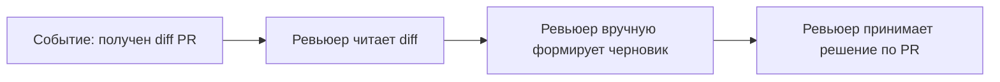
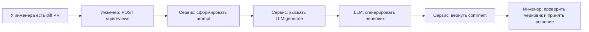

# Анализ процесса: AS IS и TO BE

Файл ведёт OpenCode. Обсудите с агентом содержание и проверьте предложенный diff. Все дополнения и исправления поручайте агенту в чате.

## AS IS

- У инженера есть diff PR; первичный черновик комментария формируется вручную без помощи LLM, на основе чтения diff.
- Время и полнота первичной фиксации замечаний зависят от человека.
- Точки задержки: чтение diff, структурирование замечаний и формулировка первичного комментария.

## TO BE

- Инженер отправляет `POST /api/reviews` с JSON `{"diff": "<строка>"}`.
- Сервис формирует prompt из diff, вызывает `LLM.generate(prompt)` и возвращает `{"comment": answer}`.
- LLM генерирует текст черновика на основе переданного prompt.
- Инженер просматривает черновик; финальное решение по PR остаётся за ним.

## Разница

| Что меняется | AS IS | TO BE | Как проверим изменение |
|---|---|---|---|
| Способ получения первичного черновика | Ручное формирование по diff. | Сервис запрашивает LLM и возвращает `{"comment": "..."}`. | Отправить `POST /api/reviews` с валидным diff; ответ содержит ключ `comment`. |
| Входная точка процесса | Ревьюер начинает с чтения diff. | Endpoint `/api/reviews` принимает JSON с ключом `diff`. | Вызвать endpoint согласно контракту и проверить ответ. |
| Роль человека | Ревьюер вручную формирует черновик и принимает решение. | Ревьюер проверяет черновик от AI и принимает решение. | Проверить, что сервис возвращает `comment`, а решение по PR выполняется человеком вне сервиса. |
| Обработка некорректного входа | Нет API-входа в рамках ручного процесса. | При отсутствии `diff` возможна ошибка доступа по ключу. | Отправить `{}` и зафиксировать отсутствие `comment` и/или ошибку. |
| Время до первичного черновика | Зависит от человека. | Ответ сервиса с черновиком после одного запроса. | Замерить время от запроса до ответа с `comment`. |

## Как использовали AI

- Для чего: сформировать согласованный черновик AS IS, TO BE и различий.
- Тип промпта: Master Prompt v3 для первой группы артефактов.
- Строка в [`prompts.md`](prompts.md): P1-04.
- Что проверил студент и какие исправления поручил агенту: явно разделены действия инженера, сервиса и LLM; сценарий не опирается на неподтверждённые интеграции.
