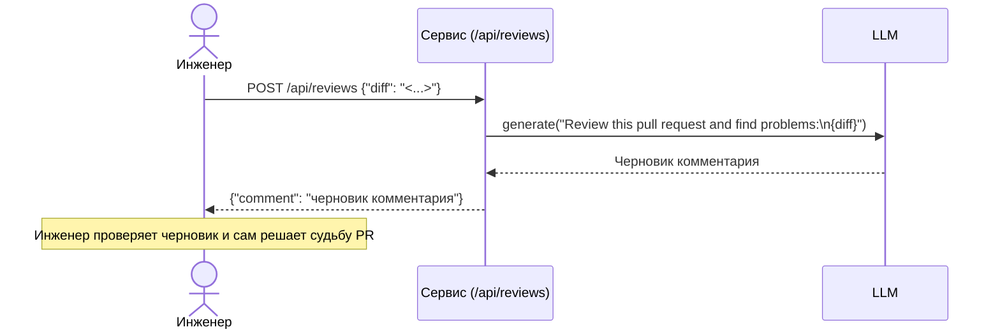

# Use cases и user stories

Файл ведёт OpenCode. Обсудите с агентом содержание и проверьте предложенный diff. Все дополнения и исправления поручайте агенту в чате.

## Первый рабочий сценарий

**Когда** инженер отправляет HTTP-запрос `POST /api/reviews` с JSON, содержащим поле `diff` со строкой diff PR, **система** формирует промпт, запрашивает у LLM черновик и возвращает ответ с ключом `comment`, **а пользователь получает** проверяемый черновик и самостоятельно принимает решение по PR.

Не входит в этот сценарий:

- Автоматический approve/merge PR.
- Интеграции с внешними системами, включая GitHub и трекеры задач.
- Аутентификация и авторизация.
- Гарантированный HTTP-статус и обработка всех ошибок.
- Хранение истории и уведомления.

## Use case

| Поле | Значение |
|---|---|
| Актор | Инженер-ревьюер. |
| Триггер | Отправка `POST /api/reviews` с телом `{"diff": "<строковый diff PR>"}`. |
| Предусловия | У инженера есть доступ к HTTP-сервису; diff представлен строкой и помещается в JSON. |
| Основной результат | Ответ содержит ключ `comment` со строковым черновиком от LLM; инженер просматривает его и самостоятельно принимает решение по PR. |
| Ошибка или отказ | При отсутствии ключа `diff` обращение `payload["diff"]` может вызвать ошибку доступа по ключу; результат запроса не содержит `comment` и/или завершается ошибкой. |



## User stories и acceptance criteria

```gherkin
Feature: Получение черновика ревью по diff
  Как инженер-ревьюер
  Я хочу отправить diff PR сервису и получить черновик комментария от LLM
  Чтобы быстрее начать ревью, оставаясь финальным решающим лицом

  Scenario: Позитивный — валидный diff передан
    Given доступен HTTP-сервис с endpoint /api/reviews
    And у меня есть строка diff PR
    When я отправляю POST /api/reviews с JSON {"diff": "<строковый diff>"}
    Then в ответе возвращается JSON, содержащий ключ "comment" со строковым значением
    And я могу просмотреть этот черновик и принять решение по PR вручную

  Scenario: Негативный — нет ключа "diff" во входе
    Given доступен HTTP-сервис с endpoint /api/reviews
    And я отправляю JSON без ключа "diff", например {}
    When я выполняю POST /api/reviews
    Then обращение к payload["diff"] может вызвать ошибку доступа по ключу на стороне сервиса
    And наблюдаемый результат: ответ не содержит "comment" и/или фиксируется ошибка обработки запроса
```

## Как использовали AI

- Для чего: подготовить сценарий, use case, диаграмму и критерии приёмки.
- Тип промпта: Master Prompt v3 для первой группы артефактов.
- Строка в [`prompts.md`](prompts.md): P1-04.
- Что проверил студент и какие исправления поручил агенту: сценарий не предполагает несуществующие интеграции, а критерии содержат наблюдаемые результаты.
